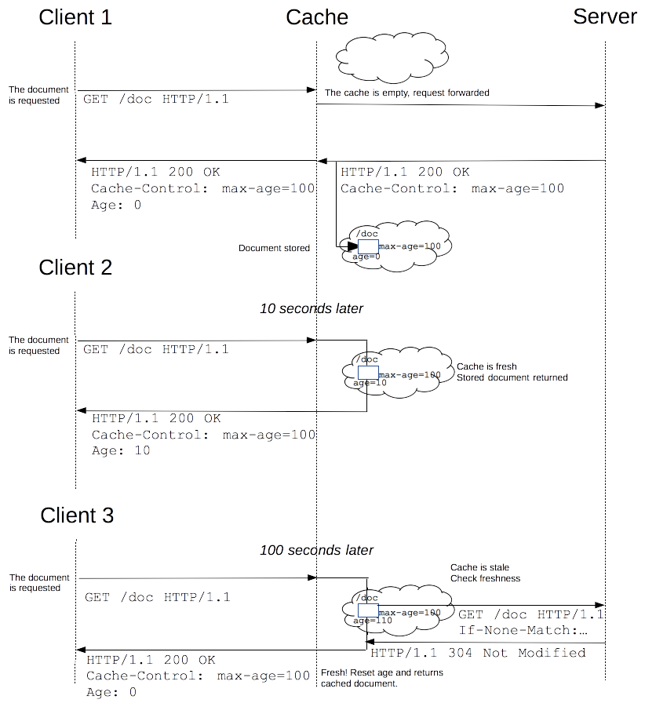

| Reference |
| --------- |
| [wiki cache](https://en.wikipedia.org/wiki/Cache_(computing)) |
| [amazon caching](https://aws.amazon.com/caching/) |
| [MDN HTTP caching](https://developer.mozilla.org/en-US/docs/Web/HTTP/Caching) |

## WHAT IS A CACHE
In computing, a cache is a hardware or software component that stores data so that future requests can be served faster.
The data stored in cache might be the result of an earlier computation or a copy of data stored elsewhere.

### Why?
The goal is to increase the performance of web sites and applications by reusing previously fetched resources.
The buffering provided by a cache benefits both latency and bandwidth consumption.

## HOW CACHING WORK?
The data in a cache is generally stored in fast access hardware such as RAM and may also be used in correlation with a software component. A cache's primary purpose is to increase data retrieval performance by reducing the need to access the underlying slower storage layer.

## TYPES OF CACHES
- HARDWARE
  - CPU cache
  - GPU cache
  - DSPs
- SOFTWARE
  - Disk cache
  - Web cache
  - Memoization
  - ...

## HTTP CACHING
Web caches reduce latency and network traffic and thus lessen the time needed to display a representation of a resource. By making use of HTTP caching, Web sites become more responsive.

There are several kinds of caches: these can be grouped into two main categories: private or shared caches.

- SHARED  = A cache that stores responses for reuse by more than one user.
- PRIVATE = A private cache is dedicated to a single user.

### Targets of caching operations
HTTP caching is optional but usually desirable. HTTP caches are typically limited to caching responses to GET
Common forms of caching entries are:

- Results of a retrieval request with a `200 (OK)` status code, containing resource like HTML, images or files.
- Permanent redirects with `301 (Moved Permanently) status code`
- Error responses `400 (Not Found)`
- Incomplete Results `206 (Partial Content)`
- Responses other than GET if something suitable for use as a chache key is defined.

## Controlling caching
The Cache-Control HTTP/1.1 general-header field is used to specify directives for caching mechanisms in both requests and responses. Use this header to define your caching policies with the variety of directives it provides.

| HTTP Header | Description |
| ----------- | ----------- |
| `Cache-Control: no-store` | The cache should not store anything about the client request or server response |
| `Cache-Control: no-cache` | A cache will send the request to the origin server for validation before releasing a cached copy. |
| `Cache-Control: public` | the response may be cached by any cache. This can be useful if pages with HTTP authentication, or response status codes that aren't normally cacheable, should now be cached. |
| `Cache-Control: private` | the response is intended for a single user only and must not be stored by a shared cache. A private browser cache may store the response in this case. |
| `Cache-Control: max-age=31536000` | the maximum amount of time in which a resource will be considered fresh. This directive is relative to the time of the request, and overrides the Expires header (if set) |
| `Cache-Control: must-revalidate` | the cache must verify the status of the stale resources before using it and expired ones should not be used. |
| `Pragma: no-cache` | Pragma should only be used for backwards compatibility with HTTP/1.0 caches where the Cache-Control HTTP/1.1 header is not yet present. |

## Freshness
